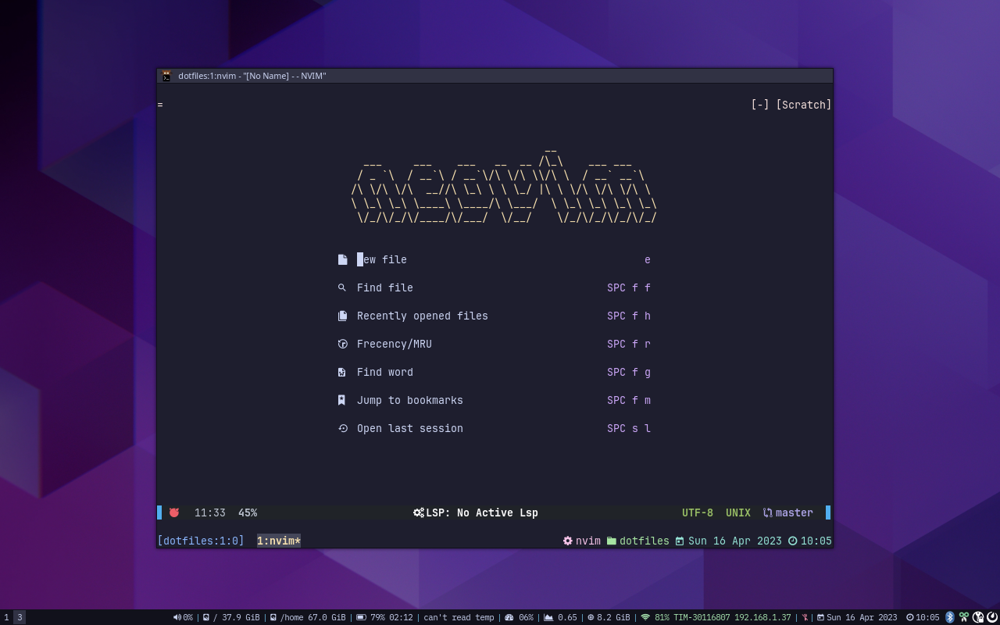

# dparo's dotfiles

## About

This repository contains my personal dotfiles.
This repository uses [ansible](https://www.ansible.com/) to bootstrap and provision a fresh install of a [Fedora](https://getfedora.org/) >37 distribution.

Ansible is an IT automation platform that serves as a good base for deploying dotfiles on a target machine: from installing required dependencies to managing and linking configuration files.

## Features

- Secrets management:
  - Installation of private SSH and GPG keys
  - Installation of private environment variables (such as API keys)
- Installation of X.509 certificates
- Installation of base-dependencies
- Git configuration
- [Nerd fonts](https://www.nerdfonts.com/) installation
- Installation of development toolchains: python, golang, c/cpp, rust, nodejs, java, maven, ...
- Automatic installation and configuration of the following desktop programs:
  - zsh with [starship prompt](https://starship.rs/)
  - [kitty terminal emulator](https://sw.kovidgoyal.net/kitty/)
  - tmux
  - i3
  - neovim (with lsp support)
  - git and [lazygit](https://github.com/jesseduffield/lazygit)
  - vscode
  - google-chrome
  - brave-browser
  - ...
- ... and much more




## Why not use other dotfiles management tools?

Contrary to other solutions for managing dotfiles such as [GNU Stow](https://www.gnu.org/software/stow/) and [dotbot](https://github.com/anishathalye/dotbot), which I both used in the past, ansible offers more features:

1. It can manage and synchronize multiple machines in a network.
2. It can do more complex tasks: such as programmatically editing single lines in configuration files, fetching remote sources, performing simple REST API queries.
3. It is a better alternative for installing software and for managing the overall dependencies of the system.
4. It can store and manage secrets.

## Installation

Install a fresh Fedora >37 Gnome distribution.

Simply run:

```bash
bash <(curl -Ls https://dparo.github.io/dotfiles)
```

to bootstrap the dotfiles.

Equivalently you can use the following command:

```bash
bash <(curl -s https://raw.githubusercontent.com/dparo/dotfiles/master/scripts/bootstrap.sh)
```
